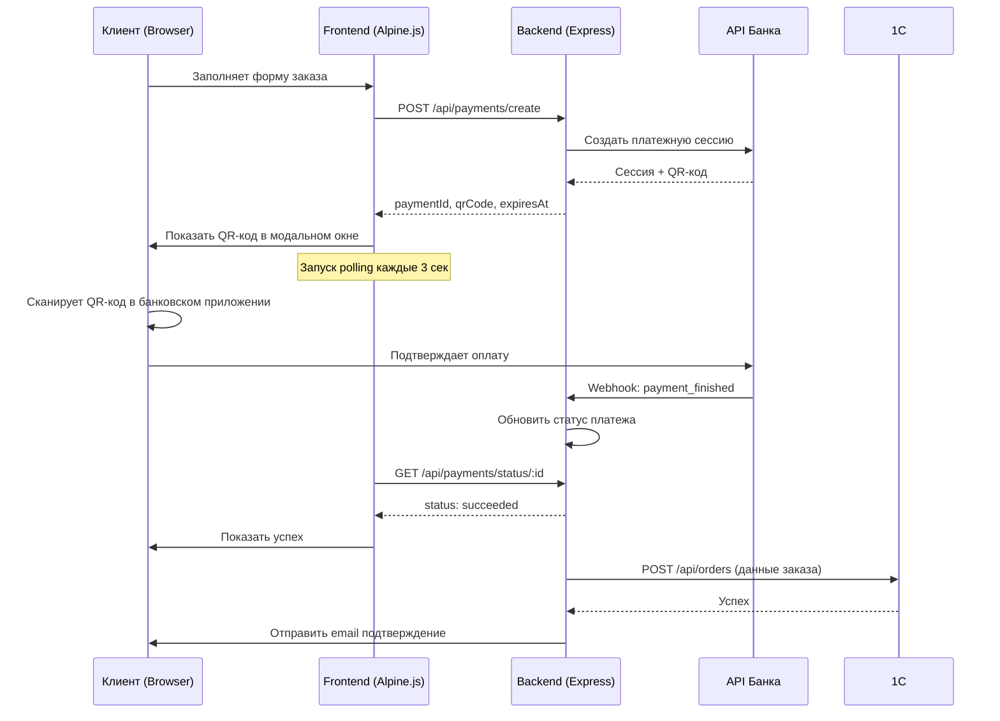
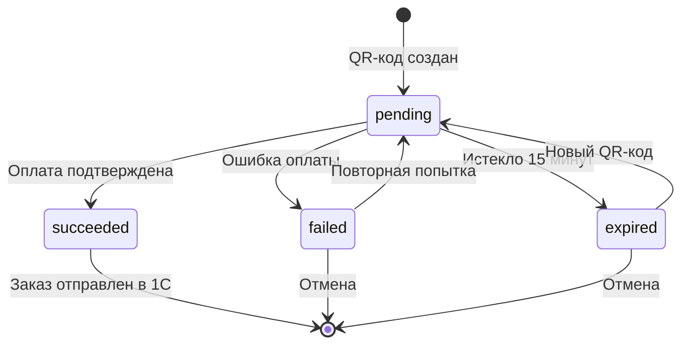
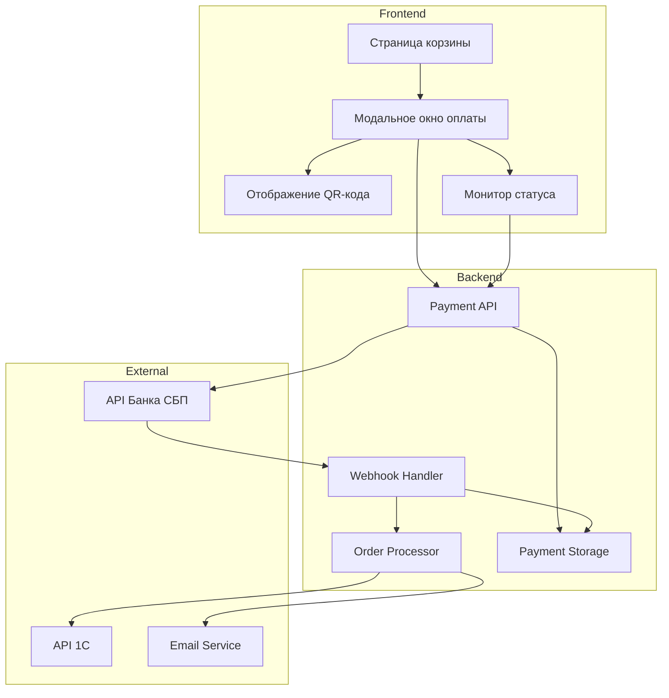

# Документ проектирования: Интеграция оплаты через СБП

## Обзор

Данный документ описывает техническое проектирование интеграции платежной системы СБП (Система Быстрых Платежей) в интернет-магазин РОСЭК. Система заменит текущий QR-код-заглушку на реальную обработку платежей через банковский API, обеспечит мониторинг статуса платежей и отправку заказов в 1С только после подтверждения оплаты.

### Ключевые особенности

- Генерация реальных QR-кодов СБП через банковский API
- Мониторинг статуса платежей в реальном времени через вебхуки
- Обработка истечения времени платежа (15 минут)
- Поддержка физических и юридических лиц
- Сохранение истории платежей для сверки
- Отправка заказов в 1С только после подтверждения оплаты

## Архитектура

### Общая схема потока оплаты

```
Клиент заполняет форму заказа
         ↓
Backend создает платежную сессию через API банка
         ↓
Backend получает QR-код и payment_id
         ↓
Frontend отображает QR-код в модальном окне
         ↓
Клиент сканирует QR-код и оплачивает в банковском приложении
         ↓
Банк отправляет вебхук на backend с подтверждением
         ↓
Backend обновляет статус платежа
         ↓
Frontend получает обновление статуса (через polling или WebSocket)
         ↓
Backend отправляет заказ в 1С
         ↓
Клиент получает подтверждение на email
```

### Компоненты системы

1. **Frontend (Alpine.js)**
   - Модальное окно оплаты с QR-кодом
   - Таймер обратного отсчета
   - Polling статуса платежа
   - Обработка ошибок и таймаутов

2. **Backend (Node.js/Express)**
   - API endpoint для создания платежной сессии
   - API endpoint для проверки статуса платежа
   - Webhook endpoint для получения уведомлений от банка
   - Интеграция с API банка (Bank 131 или аналог)
   - Сохранение истории платежей

3. **База данных (JSON файлы)**
   - Хранение информации о платежных сессиях
   - История платежей для сверки

## Компоненты и интерфейсы

### Backend API Endpoints

#### POST /api/payments/create
Создает новую платежную сессию и возвращает QR-код.

**Request:**
```json
{
  "orderData": {
    "clientType": "individual" | "legal",
    "clientInfo": {
      "fullName": "string",
      "phone": "string",
      "email": "string",
      // ... другие поля
    },
    "items": [...],
    "totalPrice": number
  }
}
```

**Response:**
```json
{
  "success": true,
  "paymentId": "pm_123456789",
  "sessionId": "ps_123456789",
  "qrCode": {
    "content": "https://qr.nspk.ru/...",
    "image": "base64_encoded_png"
  },
  "expiresAt": "2024-02-07T24:14:52Z",
  "amount": 10000
}
```

#### GET /api/payments/status/:paymentId
Проверяет текущий статус платежа.

**Response:**
```json
{
  "success": true,
  "paymentId": "pm_123456789",
  "status": "pending" | "succeeded" | "failed" | "expired",
  "transactionId": "string",
  "paidAt": "2024-02-07T24:00:00Z"
}
```

#### POST /api/payments/webhook
Принимает вебхуки от банка о статусе платежа.

**Request (от банка):**
```json
{
  "type": "payment_finished",
  "session": {
    "id": "ps_123456789",
    "status": "accepted",
    "acquiring_payments": [{
      "id": "pm_12345678",
      "status": "succeeded",
      "finished_at": "2024-02-07T23:59:52Z",
      "transaction_info": {
        "fp_message_id": "A50581324524670W0000040011450701"
      }
    }]
  }
}
```

### Frontend Components

#### PaymentModal (Alpine.js component)

**Состояния:**
- `loading` - Генерация QR-кода
- `pending` - Ожидание оплаты
- `success` - Оплата подтверждена
- `failed` - Ошибка оплаты
- `expired` - Истекло время оплаты

**Методы:**
- `initPayment()` - Инициализация платежа
- `startPolling()` - Запуск опроса статуса
- `stopPolling()` - Остановка опроса
- `handlePaymentSuccess()` - Обработка успешной оплаты
- `handlePaymentError()` - Обработка ошибки
- `regenerateQR()` - Перегенерация QR-кода

## Модели данных

### PaymentSession (server/models/payment-session.json)

```json
{
  "paymentId": "pm_123456789",
  "sessionId": "ps_123456789",
  "orderId": "order-2024-02-07T23-59-52",
  "status": "pending",
  "amount": 10000,
  "currency": "RUB",
  "clientType": "individual",
  "clientInfo": {
    "fullName": "Иван Иванов",
    "phone": "+7 (999) 123-45-67",
    "email": "ivan@example.com"
  },
  "qrCode": {
    "content": "https://qr.nspk.ru/...",
    "image": "base64_png"
  },
  "createdAt": "2024-02-07T23:59:52Z",
  "expiresAt": "2024-02-08T00:14:52Z",
  "paidAt": null,
  "transactionId": null,
  "orderData": {
    "items": [...],
    "totalItems": 5,
    "totalPrice": 10000
  }
}
```

### PaymentHistory (server/payments/history/)

Каждый платеж сохраняется в отдельный файл:
`payment-{paymentId}.json`

## Correctness Properties

*Свойство - это характеристика или поведение, которое должно выполняться во всех допустимых выполнениях системы - по сути, формальное утверждение о том, что система должна делать. Свойства служат мостом между спецификациями, понятными человеку, и гарантиями корректности, проверяемыми машиной.*

Теперь выполню анализ критериев приемки для определения тестируемых свойств.


### Свойство 1: Структура QR-кода
*Для любого* заказа, сгенерированный QR-код должен содержать уникальный ID платежа, сумму платежа, информацию о продавце и ссылку на заказ
**Валидирует: Требования 1.1, 1.2, 1.3**

### Свойство 2: Отображение информации о платеже
*Для любого* отображаемого QR-кода, модальное окно должно показывать сумму платежа, номер заказа и время истечения
**Валидирует: Требования 1.5**

### Свойство 3: Уведомление при подтверждении
*Для любого* изменения статуса платежа на "подтвержден", монитор платежей должен немедленно уведомить обработчик заказов
**Валидирует: Требования 2.2**

### Свойство 4: Синхронизация UI со статусом
*Для любого* изменения статуса платежа, модальное окно должно обновить интерфейс для отражения текущего статуса
**Валидирует: Требования 2.3**

### Свойство 5: Время истечения QR-кода
*Для любого* сгенерированного QR-кода, время истечения должно быть установлено ровно на 15 минут от времени создания
**Валидирует: Требования 3.1**

### Свойство 6: Уникальность при перегенерации
*Для любой* перегенерации QR-кода, система должна создать новый уникальный идентификатор платежа, отличный от предыдущего
**Валидирует: Требования 3.4**

### Свойство 7: Логирование таймаутов
*Для любого* истечения времени платежа, система должна записать в лог незавершенную попытку оплаты с полными деталями заказа
**Валидирует: Требования 3.5**

### Свойство 8: Отправка в 1С после подтверждения
*Для любого* подтвержденного платежа, обработчик заказов должен отправить данные заказа в 1С через endpoint /api/orders
**Валидирует: Требования 4.1**

### Свойство 9: Блокировка отправки до подтверждения
*Для любого* платежа с неподтвержденным статусом (pending, failed, expired), система не должна отправлять данные в 1С
**Валидирует: Требования 4.2**

### Свойство 10: Структура данных для 1С
*Для любой* отправки в 1С, запрос должен включать детали подтверждения платежа, ID транзакции и тип клиента
**Валидирует: Требования 4.3, 5.4**

### Свойство 11: Email после успешной отправки
*Для любой* успешной отправки заказа в 1С, система должна отправить подтверждающее письмо на email покупателя
**Валидирует: Требования 4.4**

### Свойство 12: Retry логика для 1С
*Для любой* неудачной отправки в 1С после подтверждения оплаты, система должна повторить попытку максимум 3 раза с экспоненциальной задержкой (1с, 2с, 4с)
**Валидирует: Требования 4.5**

### Свойство 13: Данные клиента в зависимости от типа
*Для любого* заказа, QR-код и метаданные платежа должны содержать соответствующую информацию о клиенте: для физлиц - ФИО, телефон, email; для юрлиц - дополнительно ИНН, КПП, юридический адрес
**Валидирует: Требования 5.1, 5.2, 5.3**

### Свойство 14: Инструкции по типу клиента
*Для любого* типа клиента, модальное окно должно отображать соответствующие инструкции по оплате (различающиеся для физлиц и юрлиц)
**Валидирует: Требования 5.5**

### Свойство 15: Retry логика для проверки статуса
*Для любой* неудачной проверки статуса платежа, монитор должен повторить попытку максимум 5 раз перед отображением ошибки
**Валидирует: Требования 6.2**

### Свойство 16: Обработка и логирование ошибок
*Для любой* ошибки в системе, должно отображаться понятное сообщение пользователю с контактной информацией поддержки, и детальная информация об ошибке должна быть записана в лог
**Валидирует: Требования 6.3, 6.5**

### Свойство 17: Персистентность платежных данных
*Для любого* платежа, система должна сохранять запись, содержащую временную метку создания, детали заказа, ID платежа, текущий статус, ID транзакции (если есть), и обновлять эту запись при каждом изменении статуса
**Валидирует: Требования 7.1, 7.2, 7.3, 7.4**

### Свойство 18: Валидация запросов к API СБП
*Для любого* вызова API СБП, запрос должен включать все обязательные параметры согласно спецификации, и ответ должен быть провалидирован перед обработкой
**Валидирует: Требования 9.3, 9.5**

### Свойство 19: Обработка rate limiting
*Для любого* ответа API СБП с кодом 429 (rate limit), система должна применить экспоненциальную задержку и повторить запрос
**Валидирует: Требования 9.4**

### Свойство 20: Защита конфиденциальных данных
*Для любых* данных, сохраняемых в хранилище или логах, не должно быть банковских учетных данных клиентов, информации о картах или других конфиденциальных платежных данных
**Валидирует: Требования 10.2, 10.4**

### Свойство 21: Валидация вебхуков
*Для любого* входящего вебхука о платеже, система должна валидировать подпись запроса для предотвращения мошеннических подтверждений
**Валидирует: Требования 10.5**

## Обработка ошибок

### Типы ошибок

1. **Ошибки генерации QR-кода**
   - Недоступность API банка
   - Неверные параметры запроса
   - Таймаут запроса
   - **Обработка**: Показать сообщение об ошибке с кнопкой "Повторить попытку"

2. **Ошибки проверки статуса**
   - Недоступность API банка
   - Таймаут запроса
   - **Обработка**: Автоматический retry до 5 раз, затем показать ошибку

3. **Ошибки отправки в 1С**
   - Недоступность endpoint
   - Ошибка валидации данных
   - **Обработка**: Автоматический retry до 3 раз с экспоненциальной задержкой

4. **Истечение времени платежа**
   - QR-код истек (15 минут)
   - **Обработка**: Показать сообщение с кнопкой "Создать новый QR-код"

5. **Отклонение платежа банком**
   - Недостаточно средств
   - Технические проблемы банка
   - **Обработка**: Показать причину отклонения и кнопку "Попробовать снова"

### Логирование ошибок

Все ошибки логируются с уровнем `error` и включают:
- Временную метку
- Тип ошибки
- Детали ошибки (без конфиденциальных данных)
- ID платежа/заказа
- Stack trace (для технических ошибок)

## Стратегия тестирования

### Двойной подход к тестированию

Система использует комбинацию unit-тестов и property-based тестов для обеспечения корректности:

**Unit-тесты** проверяют:
- Конкретные примеры и сценарии
- Граничные случаи
- Обработку ошибок
- Интеграционные точки между компонентами

**Property-based тесты** проверяют:
- Универсальные свойства, которые должны выполняться для всех входных данных
- Комплексное покрытие входных данных через рандомизацию
- Инварианты системы

### Конфигурация property-based тестов

- Минимум 100 итераций на каждый property-тест (из-за рандомизации)
- Каждый property-тест должен ссылаться на свойство из документа проектирования
- Формат тега: **Feature: sbp-payment-integration, Property {номер}: {текст свойства}**

### Библиотеки для тестирования

**Backend (Node.js)**:
- Jest - основной фреймворк для тестирования
- fast-check - библиотека для property-based тестирования
- supertest - тестирование HTTP endpoints
- nock - мокирование HTTP запросов к внешним API

**Frontend (Alpine.js)**:
- Jest - основной фреймворк
- @testing-library/dom - тестирование DOM
- fast-check - property-based тестирование
- MSW (Mock Service Worker) - мокирование API запросов

### Примеры тестов

**Unit-тест (пример):**
```javascript
describe('Payment timeout handling', () => {
  it('should display timeout message after 15 minutes', async () => {
    // Arrange
    const payment = createPayment();
    jest.advanceTimersByTime(15 * 60 * 1000);
    
    // Act
    const status = await checkPaymentStatus(payment.id);
    
    // Assert
    expect(status).toBe('expired');
    expect(screen.getByText(/время истекло/i)).toBeInTheDocument();
  });
});
```

**Property-тест (пример):**
```javascript
// Feature: sbp-payment-integration, Property 1: Структура QR-кода
describe('QR code structure property', () => {
  it('should always include required fields for any order', () => {
    fc.assert(
      fc.property(
        orderArbitrary(), // генератор случайных заказов
        (order) => {
          const qrCode = generateQRCode(order);
          
          expect(qrCode).toHaveProperty('paymentId');
          expect(qrCode).toHaveProperty('amount', order.totalPrice);
          expect(qrCode).toHaveProperty('merchantInfo');
          expect(qrCode).toHaveProperty('orderReference');
          expect(qrCode.paymentId).toMatch(/^pm_\d+$/);
        }
      ),
      { numRuns: 100 }
    );
  });
});
```

### Тестовые данные

**Генераторы для property-based тестов:**
- `orderArbitrary()` - генерирует случайные заказы с валидными данными
- `clientArbitrary()` - генерирует случайных клиентов (физлица и юрлица)
- `paymentStatusArbitrary()` - генерирует случайные статусы платежей
- `webhookArbitrary()` - генерирует случайные вебхуки от банка

### Покрытие тестами

Целевое покрытие кода:
- Общее покрытие: минимум 80%
- Критические пути (генерация QR, обработка платежей): минимум 95%
- Обработка ошибок: минимум 90%

## Диаграммы

### Диаграмма последовательности: Успешная оплата



### Диаграмма состояний: Статусы платежа



### Диаграмма компонентов



## Технические детали реализации

### Переменные окружения

```env
# API Банка СБП
SBP_API_URL=https://api.bank131.ru
SBP_MERCHANT_ID=your_merchant_id
SBP_API_KEY=your_api_key
SBP_WEBHOOK_SECRET=your_webhook_secret

# Настройки платежей
PAYMENT_TIMEOUT_MINUTES=15
PAYMENT_POLL_INTERVAL_SECONDS=3
PAYMENT_RETRY_ATTEMPTS=3

# Существующие настройки
EMAIL_USER=your_email@gmail.com
EMAIL_PASS=your_app_password
ORDER_EMAIL=orders@rosek.tech
```

### Структура файлов

```
server/
  ├── payments/
  │   ├── payment-service.js      # Логика работы с платежами
  │   ├── qr-generator.js         # Генерация QR-кодов
  │   ├── status-monitor.js       # Проверка статуса
  │   ├── webhook-handler.js      # Обработка вебхуков
  │   └── history/                # История платежей (JSON файлы)
  │       └── payment-{id}.json
  ├── routes/
  │   └── payments.js             # API endpoints для платежей
  └── server.js                   # Основной файл сервера

js/
  └── payment.js                  # Frontend логика оплаты

category/
  └── cart.html                   # Обновленная страница корзины

css/
  └── main.css                    # Стили модального окна оплаты
```

### API банка: Примеры запросов

**Создание платежной сессии:**
```javascript
POST https://api.bank131.ru/session/create
Headers:
  Content-Type: application/json
  Authorization: Bearer {API_KEY}

Body:
{
  "customer": {
    "reference": "order_123"
  },
  "payment_details": {
    "type": "faster_payment_system",
    "faster_payment_system": {
      "description": "Оплата заказа №123"
    }
  },
  "amount_details": {
    "amount": 10000,
    "currency": "RUB"
  }
}
```

**Запуск платежа:**
```javascript
POST https://api.bank131.ru/session/start/payment
Headers:
  Content-Type: application/json
  Authorization: Bearer {API_KEY}

Body:
{
  "session_id": "ps_123456789",
  "payment_options": {
    "return_url": "https://rosek.tech/cart",
    "recurrent": false
  }
}
```

### Безопасность

**Валидация вебхуков:**
```javascript
function validateWebhook(req) {
  const signature = req.headers['x-partner-sign'];
  const payload = JSON.stringify(req.body);
  const secret = process.env.SBP_WEBHOOK_SECRET;
  
  const expectedSignature = crypto
    .createHmac('sha256', secret)
    .update(payload)
    .digest('hex');
  
  return signature === expectedSignature;
}
```

**Защита от повторной обработки:**
```javascript
const processedWebhooks = new Set();

function isWebhookProcessed(webhookId) {
  if (processedWebhooks.has(webhookId)) {
    return true;
  }
  processedWebhooks.add(webhookId);
  return false;
}
```

## Производительность

### Оптимизации

1. **Кэширование статуса платежей**
   - Кэш в памяти для активных платежей
   - TTL: 15 минут (время жизни QR-кода)

2. **Debouncing polling запросов**
   - Минимальный интервал между запросами: 3 секунды
   - Остановка polling при закрытии модального окна

3. **Оптимизация размера QR-кода**
   - Использование SVG вместо PNG где возможно
   - Сжатие PNG изображений

4. **Batch обработка вебхуков**
   - Обработка нескольких вебхуков в одной транзакции
   - Предотвращение race conditions

### Мониторинг

Ключевые метрики для отслеживания:
- Время генерации QR-кода (целевое: < 2 сек)
- Процент успешных платежей
- Процент истекших платежей
- Среднее время до подтверждения оплаты
- Количество ошибок API банка
- Количество неудачных отправок в 1С
